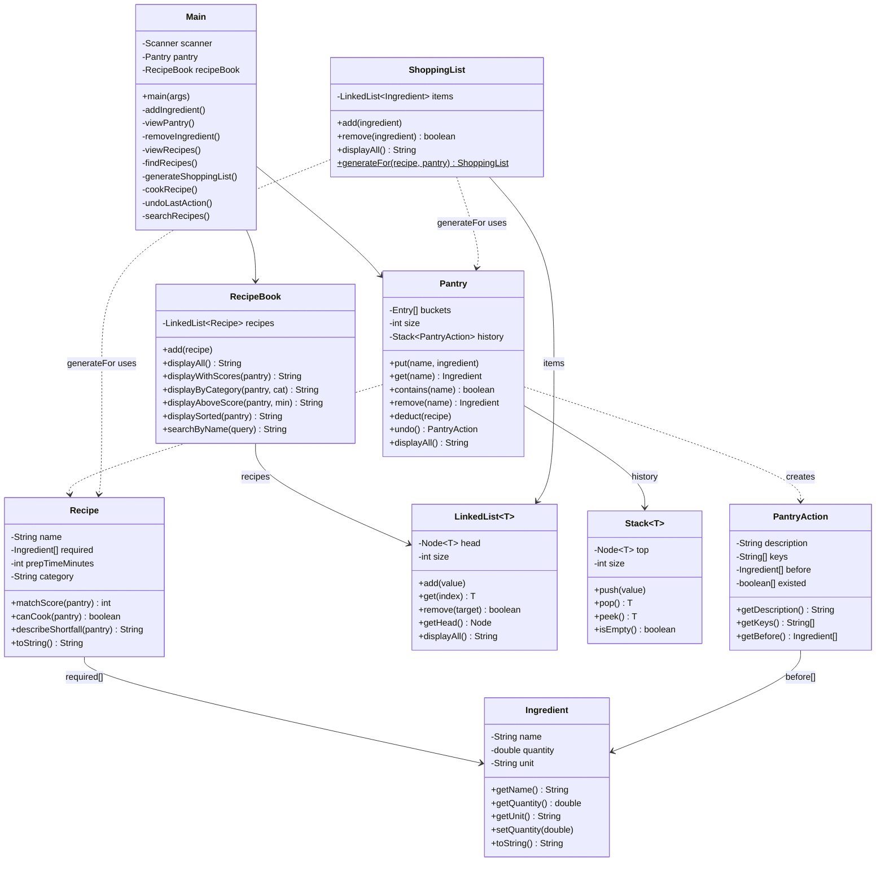

# Dog Food — Class Diagram

## Relationship Notes

- **Main** owns one `Pantry` and one `RecipeBook` and routes user
  input to feature handlers
- **Pantry** is a hash table of ingredients with a `Stack<PantryAction>`
  for undo history
- **Recipe** holds a fixed array of `Ingredient` objects representing
  what's required
- **RecipeBook** stores recipes in a `LinkedList<Recipe>` and exposes
  filtered, sorted, and searched views
- **ShoppingList** wraps a `LinkedList<Ingredient>` and is built via
  the static factory `generateFor(recipe, pantry)`
- **PantryAction** is a snapshot-based record used to reverse changes;
  Pantry creates them, Stack stores them
- Solid arrows are owns/contains; dotted arrows are uses/depends-on